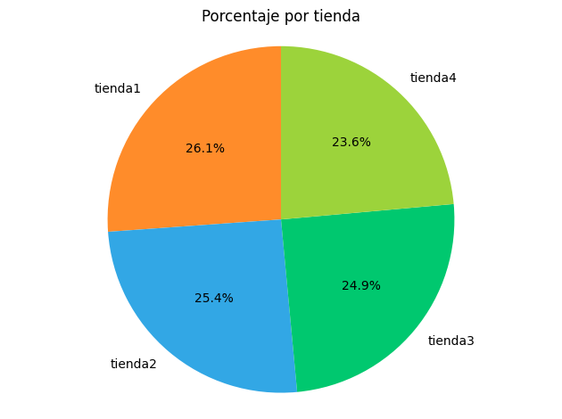
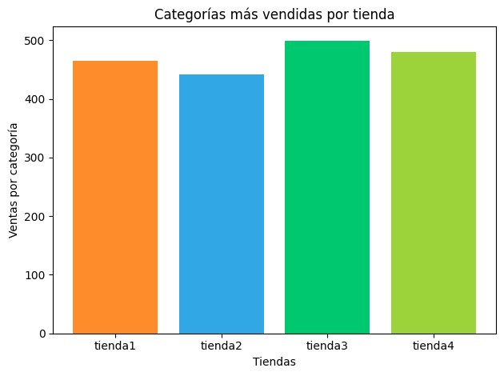
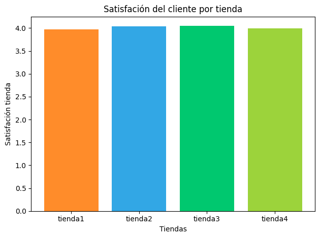
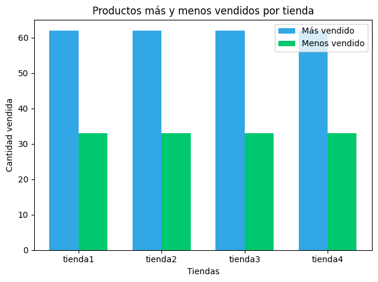
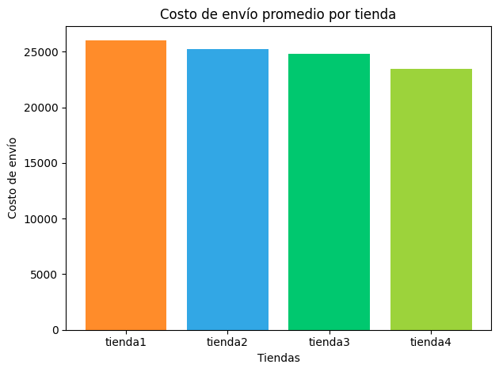

# 🛍️ Alura Store - Análisis de Datos

## 📌 Propósito del análisis

Este proyecto tiene como objetivo analizar los datos de ventas de **cuatro tiendas** pertenecientes a Alura Store.  
El fin es ayudar al Sr. Juan a decidir cuál tienda vender para obtener liquidez e invertir en un nuevo negocio, identificando aquella con menor desempeño global a través de métricas como facturación, utilidad, calificaciones y volumen de ventas.

---

## 🗂️ Estructura del proyecto

AluraStoreLatam/
├── AluraStoreLatam.ipynb # Notebook principal con el análisis completo
├── README.md # Documentación del proyecto
├── images/ # Carpeta con gráficos generados
│ ├── facturacion.png
│ ├── categorias.png
│ ├── satisfacion.png
│ ├── productos_vendidos.png
│ └── envio_promedio.png

---

## 📊 Ejemplos de gráficos e insights obtenidos

### ✅ Facturación por tienda


- Tienda1: $1,150,880,400 → 26.13% del total
- Tienda2: $1,116,343,500 → 25.35%
- Tienda3: $1,098,019,600 → 24.93%
- Tienda4: $1,038,375,700 → 23.58%

La **tienda4** tuvo la facturación más baja.

---

### 🛒 Categorías más vendidas


En todas las tiendas, la categoría más vendida fue **Muebles**, mientras que las menos vendidas variaron:  
- Tienda1 y tienda2: Artículos para el hogar
- Tienda3 y tienda4: Instrumentos musicales

---

### ⭐ Calificación promedio


- Tienda1: 3.98
- Tienda2: 4.04
- Tienda3: 4.05
- Tienda4: 4.00

La tienda4 quedó levemente por debajo de la media.

---

### 📦 Productos más y menos vendidos


Producto más vendido en todas: **Cama box**  
Producto menos vendido en todas: **Guitarra eléctrica**

---

### 🚚 Coste de envío promedio


- Tienda1: $26,018.61
- Tienda2: $25,216.24
- Tienda3: $24,805.68
- Tienda4: $23,459.46

La tienda4 tiene el coste de envío más bajo.

---

## ▶️ Cómo ejecutar el notebook

1. Clona este repositorio o descarga el archivo `AluraStoreLatam.ipynb`.
2. Abre el notebook en [Google Colab](https://colab.research.google.com/) o localmente con Jupyter.
3. Instala las dependencias si es necesario:
```bash
pip install pandas matplotlib numpy
